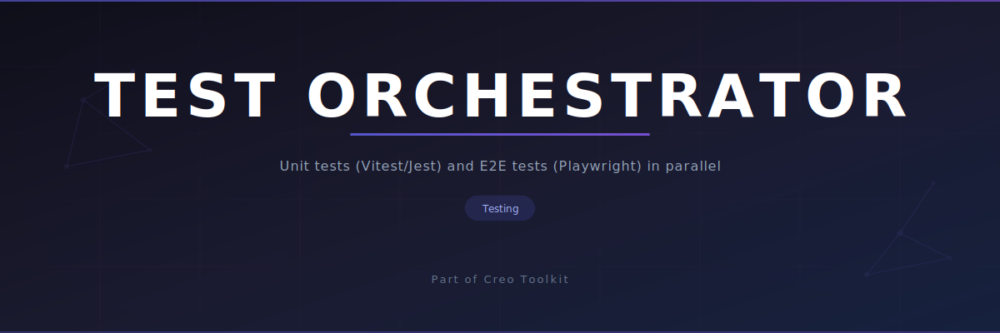

<p align="center"></p>

# claude-test-orchestrator

AI-powered test orchestration skill for Claude Code -- unit tests (Vitest/Jest) and E2E tests (Playwright) with parallel subagents.

[](https://github.com/creo-kit/claude-test-orchestrator)
[](LICENSE)

## What It Does

- **Parallel test execution** -- orchestrates unit and E2E test subagents simultaneously
- **Unit tests** -- Vitest, Jest, and Testing Library for components, hooks, stores, and services
- **E2E tests** -- Playwright for full user flows, auth, responsive layouts, and cross-page navigation
- **Coverage analysis** -- identifies untested files and prioritizes gaps by criticality
- **Test generation from code** -- reads source files and generates tests with proper mocking patterns

## Install

```bash
curl -fsSL https://raw.githubusercontent.com/creo-kit/claude-test-orchestrator/main/install.sh | bash
```

Or clone manually:

```bash
git clone https://github.com/creo-kit/claude-test-orchestrator.git
cd claude-test-orchestrator
bash install.sh
```

## Usage

```
/creo test unit         # Write or run unit/integration tests
/creo test e2e          # Write or run end-to-end Playwright tests
/creo test full         # Run both unit and E2E tests
/creo test plan         # Create a structured test plan for a feature
/creo test coverage     # Analyze test coverage and identify gaps
```

### Example: Generate tests for a component

```
/creo test unit
> Write tests for the UserProfile component
```

The unit test subagent reads your component source, identifies props, hooks, and interactions, then generates comprehensive tests using your project's test utilities and factory functions.

### Example: E2E test a user flow

```
/creo test e2e
> Test the checkout flow end to end
```

The E2E subagent maps the user flow across pages, writes Playwright tests with semantic locators, handles auth state reuse, and adds responsive viewport tests.

## Uninstall

```bash
curl -fsSL https://raw.githubusercontent.com/creo-kit/claude-test-orchestrator/main/uninstall.sh | bash
```

Or run locally:

```bash
bash uninstall.sh
```

## Part of Creo

This is a standalone spin-off from [Creo](https://github.com/oyusypenko/creo), a design and development toolkit for Claude Code with 12 skills, 12 subagents, and 3 extensions.

## Compatibility

| Platform | Supported |
|----------|-----------|
| Claude Code | Yes |
| Codex CLI | Yes |
| Cursor | Yes |
| Gemini CLI | Yes |

## License

[MIT](LICENSE)
